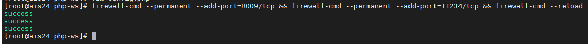
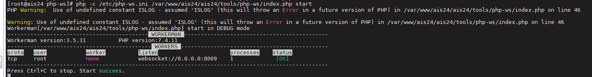
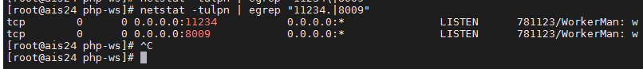
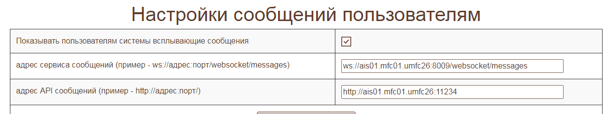
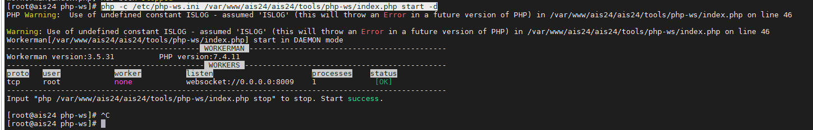
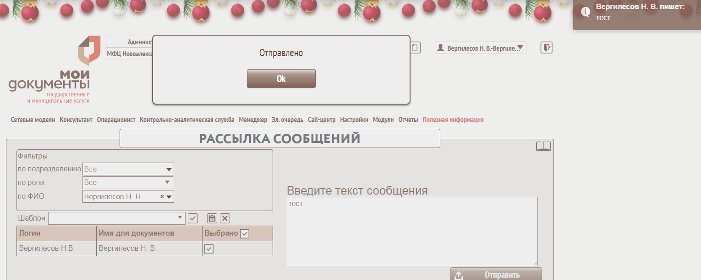

Эти действия выполняются на машине АИС

`vim /var/www/ais24/ais24/tools/php-ws/config.php`

`define('MFCPATH', __DIR__ . '/../../');`

Или командой

`sed -i "/define('MFCPATH'/c\define('MFCPATH', __DIR__ . '/../../');" /var/www/ais26/ais26/tools/php-ws/config.php`

Правим при необходимости порты: порт вебсокета и порт встроенного http сервера (для api)

Добавляем эти порты в разрешенные

`firewall-cmd --permanent --add-port=8009/tcp --add-port=11234/tcp && firewall-cmd --reload`



Создаем копию файла php.ini

`cp /etc/php.ini /etc/php-ws.ini`

`vim /etc/php-ws.ini`

Вносим правки

`error_reporting = E_ALL & ~E_NOTICE & ~E_STRICT & ~E_DEPRECATED & ~E_WARNING` `...`

`mbstring.func_overload = 0`

Или командой

`sed -i '/error_reporting = E_ALL & ~E_DEPRECATED & ~E_STRICT/c\error_reporting = E_ALL & ~E_NOTICE & ~E_STRICT & ~E_DEPRECATED & ~E_WARNING' /etc/php-ws.ini && sed -i '/mbstring.func_overload = 7/c\mbstring.func_overload = 0' /etc/php-ws.ini`

Запускаем сервис командой

`php -c /etc/php-ws.ini /var/www/ais24/ais24/tools/php-ws/index.php start`

Сервис запускается в DEBUG режиме.



Проверяем порты

`netstat -tulpn | egrep "11234.|8009"`



Проверяем настройки сервиса сообщений:



Для запуска сервиса в режиме демона

`php -c /etc/php-ws.ini /var/www/ais24/ais24/tools/php-ws/index.php start -d`



На данный Warning не обращаем внимание. Это из-за ошибки написания кода.

Всё, что выше, одной командой:

`sed -i "/define('MFCPATH'/c\define('MFCPATH', __DIR__ . '/../../');" /var/www/ais25/ais25/tools/php-ws/config.php && firewall-cmd --permanent --add-port=8009/tcp --add-port=11234/tcp && firewall-cmd --reload && cp /etc/php.ini /etc/php-ws.ini && sed -i '/error_reporting = E_ALL & ~E_DEPRECATED & ~E_STRICT/c\error_reporting = E_ALL & ~E_NOTICE & ~E_STRICT & ~E_DEPRECATED & ~E_WARNING' /etc/php-ws.ini && sed -i '/mbstring.func_overload = 7/c\mbstring.func_overload = 0' /etc/php-ws.ini && php -c /etc/php-ws.ini /var/www/ais25/ais25/tools/php-ws/index.php start -d && netstat -tulpn | egrep "11234.|8009"`

### Запуск после рестарта

Редактируем `crontab`

`crontab -e`

`@reboot php -c /etc/php-ws.ini /var/www/ais24/ais24/tools/php-ws/index.php start -d >/dev/null 2>&1`

#### Правки на 19 машине

Открываем порты

`firewall-cmd --permanent --add-port=8009/tcp --add-port=11234/tcp && firewall-cmd --reload`

Создаем файл

`vi /etc/nginx/conf.d/00-websockets.conf`

И вносим в него

```server {
    listen 8009;
    location / {
      proxy_set_header Host $host;
      proxy_pass http://php-ws;

      proxy_http_version 1.1;
      proxy_set_header Upgrade $http_upgrade;
      proxy_set_header Connection "Upgrade";
    }
  }

upstream php-ws {
    # enable sticky session based on IP
    ip_hash;
    server 192.168.254.164:8009;
  }

server {
   listen 11234;
   location / {
       proxy_pass http://192.168.254.164:11234;
    }
}
```

Правим IP (`192.168.254.164`) на нужный адрес машины АИС.

Правим файл **/etc/nginx/nginx.conf**, добавив _map_ в блок _http { … }_

`vi /etc/nginx/nginx.conf`

```http {
    #...
    map $http_upgrade $connection_upgrade{
            default upgrade;
            `` close;    
    }
#...
}
```

Обязательно после сохранения файлов проверить правильность конфигурации выполнив:

`nginx -t`

_**nginx: the configuration file /etc/nginx/nginx.conf syntax is ok**_  
_**nginx: configuration file /etc/nginx/nginx.conf test is successful**_

При положительном результате в выводе будет приведенное выше сообщение или Syntax OK в зависимости от версии пакета. Если найдены ошибки выведутся названия файлов и строки на которых ошибки обнаружены.

После тестирования серверу необходимо дать команду на перечитывание конфигов (опция **-s** обозначает signal, серверу можно отправить множество сигналом, но чаще всего это reload, stop и start)

`nginx -s reload`

Если ошибки все же есть и конфиги предварительно не тестировались nginx -s reload перезапустит nginx только в случае если к остановке веб-сервера это не приведет, т.е. если серьезных ошибок в конфигурации нет

Вносим запись в файл hosts

`echo "192.168.254.164 ais27.mfc27.umfc26" >> /etc/hosts`

### Проверяем сервис



