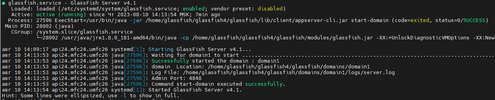

#Изменение в настройки службы Glassfish

###Приложение, запускаемое службой долго стартует. Дефолтного времени не хватает, поэтому служба не может стартануть.

Редактируем службу

`vi /etc/systemd/system/glassfish.service`

Добавляем

```
TimeoutStartSec=300
Restart=on-failure
RestartSec=15
```

Перечитыываем конфигурацию служб

`systemctl daemon-reload`

Запускаем службу

`systemctl start glassfish`

Смотрим статус

`systemctl status glassfish`

