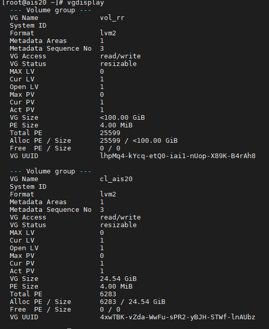

`vgrename cl_aistemplate cl_ais20`

Для машины БД

`vgrename cl_db14 cl_db16`

Смотрим, что получилось

`vgdisplay`


Меняем метку, где `cl_ais20-root` - группа, `ais20`-метка

`e2label /dev/mapper/cl_ais20-root ais20`

Для машины БД

`e2label /dev/mapper/cl_db16-root db16`

**Редактируем** `/etc/fstab`

`vim /etc/fstab`

Меняем на
`/dev/mapper/cl_ais20-root / ext4 defaults 1 1`
Вносим изменения в GRUB

`vim /etc/default/grub`

До


После


**Правим GRUB2 конфигурационный файл**

Перед изменением

`cat /boot/grub2/grub.cfg | grep cl_aistemp`


Внесем изменения через sed

`sed -i 's/cl_aistemplate/cl_ais20/g' /boot/grub2/grub.cfg`

Для БД

`sed -i 's/cl_db14/cl_db22/g' /boot/grub2/grub.cfg`

После изменения

`cat /boot/grub2/grub.cfg | grep cl_ais`


`reboot`

При загрузке жмем **е**


Правим в двух местах


Прописываем правильные. Жмем ctrl+x

Генерируем новый grup файл

`grub2-mkconfig -o /boot/grub2/grub.cfg`


<details>
<summary>Неактуально, но пока оставим</summary>
**Активируем новую группу домов и обновляем атрибуты**

```
vgchange -ay
lvchange /dev/cl_ais20/root --refresh
lvchange /dev/vol_rr/rr --refresh
```

**Образ ядра initramfs необходимо перестроить, чтобы отразить изменение имени группы томов LVM.**

Смотрим текущее ядро

`uname -r`


Сделаем копию

`cp /boot/initramfs-$(uname -r).img /boot/initramfs-$(uname -r).img.`

</details>

**Образ ядра initramfs необходимо перестроить, чтобы отразить изменение имени группы томов LVM.**

`mkinitrd -f -v /boot/initramfs-$(uname -r).img $(uname -r)`


Перегружаемся

`reboot`

f