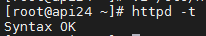
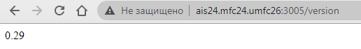
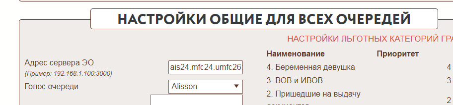

**Работы проводятся на машине АИС**

Node.js доступен в репозитории программного обеспечения AppStream, который по умолчанию используется в CentOS 8. Существует несколько доступных версий и вы можете выбирать между ними, активируя соответствующий поток модуля. В первую очередь просмотрите список доступных потоков для модуля nodejs с помощью команды dnf:

`sudo dnf module list nodejs`

Нам необходимо установить 10 версию. Она активирована по умолчанию.

> CentOS 7 не имеет свежих версий nodejs, поэтому поставить актуальную версию можно добавив репозиторий:
{.is-info}

`curl -sL https://rpm.nodesource.com/setup_14.x | sudo bash -`

> Внимание! С версией 14 сервер ЭО не работает! Чтобы откатить версию ниже, используйте:
{.is-warning}

```
curl -sL https://rpm.nodesource.com/setup_12.x | sudo bash -
curl -sL https://rpm.nodesource.com/setup_10.x | sudo bash -
sudo yum clean all && sudo yum makecache fast
sudo yum install -y nodejs
```

Далее необходимо создать файл с содержимым ниже с разрешением .sh (например, setup_elque.sh) и запустить его _sh setup_elque.sh_

```bash
#!/bin/bash
PATH=/etc:/bin:/sbin:/usr/bin:/usr/sbin:/usr/local/bin:/usr/local/sbin

# устанавливаем nodejs
dnf install nodejs

# запрашиваем у пользователя данные для подключения к базе данных
read -p "Имя пользователя базы (например, postgres): " user
read -p "IP-адресс сервера база данных (например, 127.0.0.1): " host
read -p "Имя базы данных (например, mfc_00): " database
read -p "Пароль пользователя базы данных: " password


# набор переменных для подстановки
mfcid=$(hostname | cut -d. -f 1)
mfc_elque_dir="/var/www/$mfcid/elque"
mfc_elque_mainjs="$mfc_elque_dir/main.js"
mfc_elque_configjs="$mfc_elque_dir/config.js"

# файл конфигурации сервера электронной очереди
config_file_js="

module.exports.db_conf={   
  user: '$user',
  host: '$host',
  database: '$database',
  password: '$password',
  port: 5432
}
module.exports.env_conf={
    port                    :   '3005',
    timegetvizov            :   3,  
    timeGetQueForUsers      :   3,  
    timeQueControl          :   3,  
    timeDeloOkno            :   3,  
    timeZapisToTekque       :   120,
}
module.exports.ssl={
    key_file                :   '',  
    cert_file               :   '',  
    key_pass                :   '',   
 }
"

# создаем необходимые каталоги
mkdir $mfc_elque_dir && cd $mfc_elque_dir

# качаем и распаковаем с сайта разработчиков актуальную версию сервера эл.очереди
wget --user stavtest --password S8T159 https://azovkomeks.ru/update/elque/elque.zip
unzip -o elque.zip
cp config.js.templ config.js

# открываем порт 3005 в firewall
firewall-cmd --permanent --add-port=3005/tcp && firewall-cmd --reload

# создаем файл сервиса для автоматического запуска сервера эл.очереди
echo "[Unit]
Description=elque
After=httpd.service

[Service]
Type=simple
AmbientCapabilities=CAP_SYS_RAWIO
User=root
ExecStart=/usr/bin/node $mfc_elque_mainjs
Restart=on-failure
RestartSec=5

[Install]
WantedBy=multi-user.target"  > /etc/systemd/system/elque.service

# меняем содержимое конфирурационного файла приложения
echo "$config_file_js" > $mfc_elque_configjs

# добавляем в автозагрузку и запускаем сервис
systemctl daemon-reload && systemctl enable --now elque.service 

```

**Работы проводятся на прокси-сервере**

Редактируем файл `httpd.conf`

`vi /etc/httpd/conf/httpd.conf`

Добавляем `VirtualHost`

```
listen 3005
<VirtualHost *:3005>
ServerName ais24.mfc24.umfc26
ServerAlias ais24.mfc24
ProxyRequests On
ProxyPreserveHost On
ProxyVia full
    <proxy *>
      Order deny,allow
      Allow from all
    </proxy>
ProxyPass / http://192.168.254.170:3005/
ProxyPassReverse / http://192.168.254.170:3005/
</VirtualHost>

```

Проверяем

`httpd -t`



Открываем порт

`firewall-cmd --permanent --add-port=3005/tcp && firewall-cmd --reload`

Перезапускаем сервис

`systemctl reload httpd`

Проверяем с рабочих мест пользователей и ЭО

`http://ais24.mfc24.umfc26:3005/version`



Если все нормально, прописываем в АИС

`ais24.mfc24.umfc26:3005`

