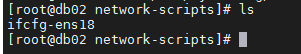
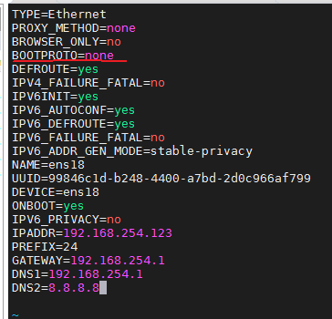
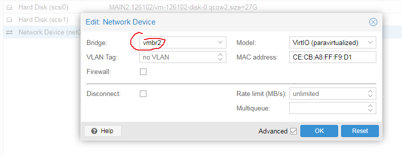

## Ручное изменение файлов

Идем в директорию /etc/sysconfig/network-scripts

`cd /etc/sysconfig/network-scripts`

Смотрим какие файлы там есть

`ls`



В нашем случае интерфейс ens18.

Производим настройки.

`vim ifcfg-ens18`

Проводим файл к такому содержимому, только IP адрес будет свой.



```IPADDR=192.168.254.123
PREFIX=24
GATEWAY=192.168.254.1
DNS1=192.168.254.1
DNS2=8.8.8.8
```

Перегружаемся.

Меняем в ВМ настройки сети.



