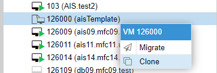

# SELinux в режиме **Permissive**Делаем клон машины из шаблона


Настройки клонирования


После создания клона запускаем машину. Затем меняем имя машины

`vim /etc/hostname`

И пароль root'а

`sudo passwd`

Перегружаемся.

`reboot`

## Создаем каталоги для АИС

Можно сделать одной строкой:

`mkdir -p /var/www/{logs,ais20/logs,ais20/rr,ais20/ais20}`

или отдельно:

```sh
mkdir -p /var/www/ais20/ais20
mkdir -p /var/www/ais20/rr
mkdir -p /var/www/ais20/logs
mkdir -p /var/www/logs
```

### Монтируем

`vim /etc/fstab`

Добавляем в конец файла

```
/dev/vol_rr/rr  /var/www/ais20/rr     xfs     defaults        0 0
```
`mount -a`

### Создаем каталоги для обмена с РР

`mkdir -p /var/www/ais20/rr/{log,archive}`

## Переименовываем VG
Инструкция [Переименование volume group](Переименование%20volume%20group.md)


## Меняем IP адрес
Инструкция [Смена IP адреса](Смена%20IP%20адреса.md)


## Заливаем архив АИС

`scp root@192.168.254.126:/var/www/ais04/ais04.tar.gz /var/www/ais20/`


Переходим в каталог, куда закинули файл

`cd /var/www/ais20/`

Распаковываем

`tar -xvzf ais04.tar.gz`

Перемещаем все файлы из папки www_stv в папку с аис

`mv ais24/* ais20/`

Удаляем каталог

`rm -rf ais24/`

Удаляем файл

`rm ais04.tar.gz`

Правим конфиги
```
vim /var/www/ais20/ais20/server.ini
vim /var/www/ais20/ais20/config/db.php
vim /var/www/ais20/ais20/config/dbFias.php
```

Выставляем владельца

`chown -R apache:apache /var/www/ais20/ais20/`

## SELinux
```
setsebool -P httpd_can_network_connect 1
setsebool -P httpd_can_network_connect_db 1
semanage fcontext -a -t httpd_sys_rw_content_t '/var/www/ais20/ais20/tmp(/.*)?'
semanage fcontext -a -t httpd_sys_rw_content_t '/var/www/ais20/ais20/tmpRosreestr(/.*)?'
semanage fcontext -a -t httpd_sys_rw_content_t '/var/www/ais20/ais20/cache(/.*)?'
semanage fcontext -a -t httpd_sys_rw_content_t '/var/www/ais20/ais20/rosreestr(/.*)?'
semanage fcontext -a -t httpd_sys_rw_content_t '/var/www/ais20/ais20/logs(/.*)?'
semanage fcontext -a -t httpd_sys_rw_content_t '/var/www/ais20/ais20/class/demons(/.*)?'
semanage fcontext -a -t httpd_sys_rw_content_t '/var/www/ais20/ais20/update(/.*)?'
restorecon -R -v /var/www/ais20/ais20/tmp/
restorecon -R -v /var/www/ais20/ais20/tmpRosreestr/
restorecon -R -v /var/www/ais20/ais20/cache/
restorecon -R -v /var/www/ais20/ais20/rosreestr/
restorecon -R -v /var/www/ais20/ais20/logs/
restorecon -R -v /var/www/ais20/ais20/class/demons/
restorecon -R -v /var/www/ais20/ais20/update/
semanage fcontext -a -t httpd_sys_rw_content_t "/var/www/logs/"
restorecon '/var/www/logs/'
semanage fcontext -a -t httpd_sys_rw_content_t "/var/www/ais20/logs"
restorecon '/var/www/ais20/logs/'
systemctl restart httpd.service
```
Все команды сразу

```
setsebool -P httpd_can_network_connect 1 && setsebool -P httpd_can_network_connect_db 1 && semanage fcontext -a -t httpd_sys_rw_content_t '/var/www/ais18/ais18/tmp(/.*)?' && semanage fcontext -a -t httpd_sys_rw_content_t '/var/www/ais18/ais18/tmpRosreestr(/.*)?' && semanage fcontext -a -t httpd_sys_rw_content_t '/var/www/ais18/ais18/cache(/.*)?' && semanage fcontext -a -t httpd_sys_rw_content_t '/var/www/ais18/ais18/rosreestr(/.*)?' && semanage fcontext -a -t httpd_sys_rw_content_t '/var/www/ais18/ais18/logs(/.*)?' && semanage fcontext -a -t httpd_sys_rw_content_t '/var/www/ais18/ais18/class/demons(/.*)?' && restorecon -R -v /var/www/ais18/ais18/tmp/ && restorecon -R -v /var/www/ais18/ais18/tmpRosreestr/ && restorecon -R -v /var/www/ais18/ais18/cache/ && restorecon -R -v /var/www/ais18/ais18/rosreestr/ && restorecon -R -v /var/www/ais18/ais18/logs/ && restorecon -R -v /var/www/ais18/ais18/class/demons/ && semanage fcontext -a -t httpd_sys_rw_content_t "/var/www/logs/" && restorecon '/var/www/logs/' && semanage fcontext -a -t httpd_sys_rw_content_t "/var/www/ais18/logs" && restorecon '/var/www/ais18/logs/' && semanage fcontext -a -t httpd_sys_rw_content_t '/var/www/ais18/ais18/update(/.*)?' && restorecon -R -v /var/www/ais18/ais18/update/ && systemctl restart httpd.service
```

Предварительно вставляем в notepad++ и меняем ais18 на нужный.

## hosts and route
Инструкция [hosts_на_АИС](hosts_на_АИС)

## Конфиг Apache
Инструкция [Config_Apache](Config_Apache)

Добавляем в ротацию логи

`vim /etc/logrotate.d/httpd`
```
/var/www/ais20/logs/*log {
    weekly
    missingok
    rotate 7
    size 100M
    compress
    delaycompress
    notifempty
    create 644 apache apache
    sharedscripts
    postrotate
        /bin/systemctl reload httpd.service > /dev/null 2>/dev/null || true
    endscript
}
```

##  Скрипт РР
Настраиваем службу

`vim /etc/systemd/system/rr.service `
```
[Unit]
Description=RR transport FTP Python script
After=httpd.service

[Service]
Type=simple
AmbientCapabilities=CAP_SYS_RAWIO
User=root
ExecStart=/usr/bin/python /var/www/ais20/rr/transportftp.py
Restart=on-failure
RestartSec=5

[Install]
WantedBy=multi-user.target
```
Копируем скрипт

`scp root@192.168.254.126:/var/www/ais04/rr/transportftp.py /var/www/ais20/rr/`

Меняем в нем данные фтп доступа и папки аис


## SELinux в режиме **Permissive**
**Временно!** Переводим SELinux в режим **Permissive**

`vim /etc/selinux/config`

